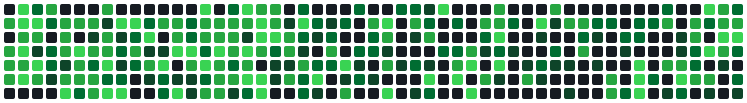

<picture>
  <source media="(prefers-color-scheme: dark)" srcset="assets/name-pixel-dark.svg" />
  <source media="(prefers-color-scheme: light)" srcset="assets/name-pixel-light.svg" />
  
</picture>

<h3>Intelligent Systems &nbsp;|&nbsp; AI in Agribusiness &nbsp;|&nbsp; Full Stack &amp; Cloud</h3>

  <b>Intelligent Systems student at FATEC Pompeia</b> 
  <b>FAPESP Undergraduate Research Fellow</b> &nbsp;·&nbsp; AI applied to Agribusiness 
  Full Stack Developer &nbsp;·&nbsp; Exploring Computer Vision, LLMs and Cloud

---

## 👋 About me

I'm **Hadryan Fortinis**, an **Intelligent Systems** student at **FATEC Pompeia**.

I work at the intersection of **full stack development** and **artificial intelligence**: I build web applications with Angular, TypeScript and Node.js while studying neural networks, computer vision and language models. As a **FAPESP undergraduate research fellow**, I bring both fronts together in my research on **AI for agribusiness**.

- 🔬 **FAPESP research fellow** — AI applied to agribusiness
- ☁️ **Cloud** pipelines (AWS / GCP / Azure) for training, deployment and data processing
- 💻 **JavaScript/TypeScript, Python, Angular, Node.js, SQL/NoSQL** and **Docker**
- 🌱 Studying **Machine Learning applied to images**
- 🤝 Open to collaborations and open source projects

 

### 🔬 Undergraduate Research — FAPESP

 

> I work as a **FAPESP undergraduate research fellow**, researching the use of **artificial intelligence and cloud computing applied to agribusiness**.

Research tracks:

| Track | What it involves |
| :--- | :--- |
| 🛰️ **Computer vision in the field** | Processing agricultural imagery (drone, satellite and camera) to analyze crops |
| 🌱 **Precision agriculture** | Models to identify patterns, anomalies and crop health indicators |
| ☁️ **Cloud infrastructure** | Training, versioning and deploying models in scalable cloud environments |
| 📊 **Agricultural data** | Collecting, cleaning and organizing agribusiness datasets to feed the models |
| 🤖 **Generative AI & LLMs** | Language models as an interpretation and decision-support layer in the field |

---

## 🚀 What I'm learning right now

> I'm currently deep into **Data Augmentation** and the **image pre-processing and processing** stages for training neural networks applied to an **LLM**.

In practice, that means studying:

| Area | Focus |
| :--- | :--- |
| 🖼️ **Pre-processing** | Normalization, resizing, filtering and cleaning of image datasets |
| 🔄 **Data Augmentation** | Rotation, flip, crop, color adjustment and noise to expand and balance datasets |
| 🧠 **Neural Networks** | Training architectures, hyperparameter tuning and model evaluation |
| 🤖 **LLMs** | Multimodal pipelines and the integration between computer vision and language |

---

## 🛠️ Technologies & Tools

### Languages

### Front-end

### Back-end &amp; Data

### DevOps &amp; Tools

### Cloud &amp; Infrastructure

 

---

## 🧠 AI, Computer Vision & Data Augmentation

The stack I've been using in my studies on **image pre-processing, data augmentation and neural network training**:

 

 

| Tool | Where it fits in my pipeline |
| :--- | :--- |
| **OpenCV / Pillow** | Reading, resizing, color space conversion and image filtering |
| **NumPy / Pandas** | Handling image tensors and organizing dataset metadata |
| **Albumentations** | Data augmentation transforms (flip, rotate, crop, blur, noise, brightness) |
| **TensorFlow / Keras** | Building and training neural networks and native augmentation layers |
| **PyTorch** | Experiments with `torchvision.transforms` and custom training loops |
| **scikit-learn** | Dataset splitting, metrics and model evaluation |
| **Matplotlib** | Visualizing augmented samples and training curves |
| **Jupyter / Anaconda** | Experimentation environment and dependency management |
| **Hugging Face** | Pre-trained models and multimodal pipelines applied to LLMs |

 

### 🌾 AI stack applied to agribusiness

Tools I use in my research on **agricultural data and field imagery**:

---

## 📊 GitHub Stats

  

---

## 📫 Let's talk?

 

💼 **LinkedIn:** [hadryan-fortinis](https://www.linkedin.com/in/hadryan-fortinis-9b990538a)  
📧 **Email:** [hadryanfortinis89@gmail.com](mailto:hadryanfortinis89@gmail.com)  
🐙 **GitHub:** [@hadryan89](https://github.com/hadryan89)

---

*"The best way to predict the future is to build it — one line of code at a time."*

<picture>
  <source media="(prefers-color-scheme: dark)" srcset="assets/contrib-grid-dark.svg" />
  <source media="(prefers-color-scheme: light)" srcset="assets/contrib-grid-light.svg" />
  
</picture>

