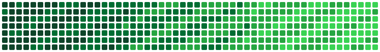

<h1>Hadryan Fortinis</h1>

<h3>Sistemas Inteligentes &nbsp;|&nbsp; IA &amp; Desenvolvimento Full Stack</h3>

  <b>Estudante de Sistemas Inteligentes na FATEC Pompeia</b> 
  Desenvolvedor Full Stack &nbsp;·&nbsp; Explorando Visão Computacional e LLMs

---

## 👋 Sobre mim

Olá! Sou o **Hadryan Fortinis**, estudante de **Sistemas Inteligentes na FATEC Pompeia** e desenvolvedor apaixonado por transformar dados em soluções reais.

Meu trabalho vive na fronteira entre o **desenvolvimento full stack** e a **inteligência artificial**: construo aplicações web modernas com Angular, TypeScript e Node.js, ao mesmo tempo em que exploro o universo de redes neurais, visão computacional e modelos de linguagem.

- 🎓 Cursando **Sistemas Inteligentes** — FATEC Pompeia
- 💻 Atuando com **JavaScript/TypeScript, Python, Angular, Node.js e bancos SQL/NoSQL**
- 🐳 Trabalhando com **Docker** para ambientes reproduzíveis e deploys consistentes
- 🌱 Aprofundando estudos em **Machine Learning aplicado a imagens**
- 🤝 Aberto a colaborações, projetos open source e boas conversas sobre tecnologia

---

## 🚀 O que estou aprendendo agora

> Atualmente estou mergulhado em **Data Augmentation** e nas etapas de **pré-processamento e processamento de imagens** para o treinamento de redes neurais aplicadas a uma **LLM**.

Na prática, isso significa estudar:

| Área | Foco |
| :--- | :--- |
| 🖼️ **Pré-processamento** | Normalização, redimensionamento, filtragem e limpeza de datasets de imagem |
| 🔄 **Data Augmentation** | Rotação, flip, crop, ajuste de cor e ruído para ampliar e balancear datasets |
| 🧠 **Redes Neurais** | Arquiteturas de treinamento, tuning de hiperparâmetros e avaliação de modelos |
| 🤖 **LLMs** | Pipelines multimodais e integração entre visão computacional e linguagem |

---

## 🛠️ Tecnologias & Ferramentas

### Linguagens

### Front-end

### Back-end &amp; Dados

### DevOps &amp; Ferramentas

 

---

## 🧠 IA, Visão Computacional & Data Augmentation

Stack que venho utilizando nos estudos de **pré-processamento de imagens, data augmentation e treinamento de redes neurais**:

 

 

| Ferramenta | Onde entra no meu pipeline |
| :--- | :--- |
| **OpenCV / Pillow** | Leitura, redimensionamento, conversão de espaço de cor e filtragem das imagens |
| **NumPy / Pandas** | Manipulação dos tensores de imagem e organização dos metadados do dataset |
| **Albumentations** | Transformações de data augmentation (flip, rotate, crop, blur, ruído, brilho) |
| **TensorFlow / Keras** | Construção e treinamento das redes neurais e camadas de augmentation nativas |
| **PyTorch** | Experimentos com `torchvision.transforms` e treinos customizados |
| **scikit-learn** | Split de datasets, métricas e avaliação dos modelos |
| **Matplotlib** | Visualização das amostras aumentadas e das curvas de treinamento |
| **Jupyter / Anaconda** | Ambiente de experimentação e controle de dependências |
| **Hugging Face** | Modelos pré-treinados e pipelines multimodais aplicados a LLMs |

---

## 📊 Estatísticas do GitHub

  

  

---

## 📫 Vamos conversar?

 

💼 **LinkedIn:** [hadryan-fortinis](https://www.linkedin.com/in/hadryan-fortinis-9b990538a)  
📧 **E-mail:** [hadryanfortinis89@gmail.com](mailto:hadryanfortinis89@gmail.com)  
🐙 **GitHub:** [@hadryan89](https://github.com/hadryan89)

---

*"A melhor forma de prever o futuro é construí-lo — uma linha de código por vez."*

