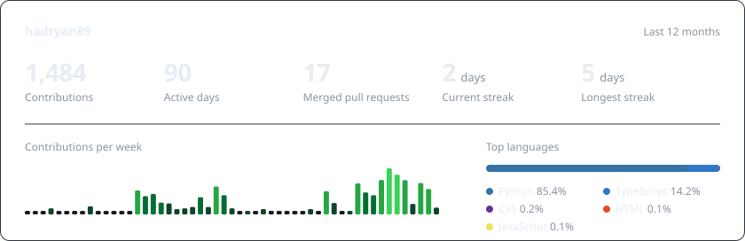

<picture>
  <source media="(prefers-color-scheme: dark)" srcset="assets/name-pixel-dark.svg" />
  <source media="(prefers-color-scheme: light)" srcset="assets/name-pixel-light.svg" />
  
</picture>

  

Intelligent Systems &nbsp;·&nbsp; AI in Agribusiness &nbsp;·&nbsp; Full Stack &amp; Cloud

## About

I'm Hadryan Fortinis, an Intelligent Systems student at FATEC Pompeia. I work between full stack development and artificial intelligence: I build web applications with Angular, TypeScript and Node.js, and study neural networks, computer vision and language models. I'm open to collaborations and open source projects.

## Research

I'm a **FAPESP undergraduate research fellow**, researching artificial intelligence and cloud computing applied to agribusiness. The work covers:

- Computer vision on drone, satellite and field imagery to analyze crops
- Precision agriculture models that detect patterns, anomalies and crop health indicators
- Cloud pipelines on AWS, GCP and Azure for training and deploying models
- Collecting and organizing agricultural datasets
- LLMs as an interpretation and decision-support layer in the field

## Currently studying

**Fine-tuning LLMs with LoRA and QLoRA.** Adapting pre-trained language and vision-language models to a specific domain by training small low-rank adapters instead of the full model, which makes it possible to specialize large models on a single GPU. My focus is on preparing instruction datasets, choosing adapter hyperparameters and evaluating the fine-tuned model against the base one.

## Stack

 
 
 
 

## Stats

<picture>
  <source media="(prefers-color-scheme: dark)" srcset="assets/stats-dark.svg" />
  <source media="(prefers-color-scheme: light)" srcset="assets/stats-light.svg" />
  
</picture>

## Contact

[LinkedIn](https://www.linkedin.com/in/hadryan-fortinis-9b990538a) &nbsp;/&nbsp; [hadryanfortinis89@gmail.com](mailto:hadryanfortinis89@gmail.com)

 

<picture>
  <source media="(prefers-color-scheme: dark)" srcset="assets/contrib-grid-dark.svg" />
  <source media="(prefers-color-scheme: light)" srcset="assets/contrib-grid-light.svg" />
  
</picture>
