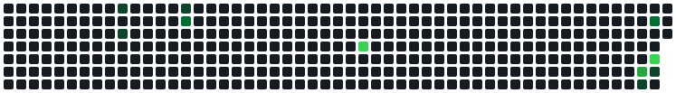

<picture>
  <source media="(prefers-color-scheme: dark)" srcset="assets/name-pixel-dark.svg" />
  <source media="(prefers-color-scheme: light)" srcset="assets/name-pixel-light.svg" />
  
</picture>

  

Intelligent Systems &nbsp;·&nbsp; AI in Agribusiness &nbsp;·&nbsp; Full Stack &amp; Cloud

## About

I'm Hadryan Fortinis, an Intelligent Systems student at FATEC Pompeia. I work between full stack development and artificial intelligence: I build web applications with Angular, TypeScript and Node.js, and study neural networks, computer vision and language models. I'm open to collaborations and open source projects.

## Research

I'm a **FAPESP undergraduate research fellow**, researching artificial intelligence and cloud computing applied to agribusiness. The work covers:

- Computer vision on drone, satellite and field imagery to analyze crops
- Precision agriculture models that detect patterns, anomalies and crop health indicators
- Cloud pipelines on AWS, GCP and Azure for training and deploying models
- Collecting and organizing agricultural datasets
- LLMs as an interpretation and decision-support layer in the field

## Currently studying

**Fine-tuning LLMs with LoRA and QLoRA.** Adapting pre-trained language and vision-language models to a specific domain by training small low-rank adapters instead of the full model, which makes it possible to specialize large models on a single GPU. My focus is on preparing instruction datasets, choosing adapter hyperparameters and evaluating the fine-tuned model against the base one.

## Stack

 
 
 
 

## Stats

<picture>
  <source media="(prefers-color-scheme: dark)" srcset="https://github-readme-stats-salesp07.vercel.app/api?username=hadryan89&amp;custom_title=GitHub%20Stats&amp;show_icons=true&amp;include_all_commits=true&amp;count_private=true&amp;show=prs_merged&amp;rank_icon=percentile&amp;card_width=420&amp;hide_border=true&amp;bg_color=00000000&amp;locale=en&amp;disable_animations=true&amp;cache_seconds=1800&amp;v=20260929b&amp;title_color=e6edf3&amp;text_color=8b949e&amp;icon_color=39d353&amp;ring_color=39d353" />
  <source media="(prefers-color-scheme: light)" srcset="https://github-readme-stats-salesp07.vercel.app/api?username=hadryan89&amp;custom_title=GitHub%20Stats&amp;show_icons=true&amp;include_all_commits=true&amp;count_private=true&amp;show=prs_merged&amp;rank_icon=percentile&amp;card_width=420&amp;hide_border=true&amp;bg_color=00000000&amp;locale=en&amp;disable_animations=true&amp;cache_seconds=1800&amp;v=20260929b&amp;title_color=1f2328&amp;text_color=59636e&amp;icon_color=1a7f37&amp;ring_color=1a7f37" />
  
</picture>
<picture>
  <source media="(prefers-color-scheme: dark)" srcset="https://github-readme-stats-salesp07.vercel.app/api/top-langs/?username=hadryan89&amp;layout=donut&amp;langs_count=5&amp;card_width=340&amp;hide_border=true&amp;bg_color=00000000&amp;locale=en&amp;disable_animations=true&amp;cache_seconds=1800&amp;v=20260929b&amp;title_color=e6edf3&amp;text_color=8b949e" />
  <source media="(prefers-color-scheme: light)" srcset="https://github-readme-stats-salesp07.vercel.app/api/top-langs/?username=hadryan89&amp;layout=donut&amp;langs_count=5&amp;card_width=340&amp;hide_border=true&amp;bg_color=00000000&amp;locale=en&amp;disable_animations=true&amp;cache_seconds=1800&amp;v=20260929b&amp;title_color=1f2328&amp;text_color=59636e" />
  
</picture>

<picture>
  <source media="(prefers-color-scheme: dark)" srcset="https://streak-stats.demolab.com?user=hadryan89&amp;hide_border=true&amp;background=00000000&amp;card_width=760&amp;locale=en&amp;stroke=30363d&amp;ring=39d353&amp;fire=39d353&amp;currStreakNum=e6edf3&amp;sideNums=e6edf3&amp;currStreakLabel=39d353&amp;sideLabels=8b949e&amp;dates=8b949e" />
  <source media="(prefers-color-scheme: light)" srcset="https://streak-stats.demolab.com?user=hadryan89&amp;hide_border=true&amp;background=00000000&amp;card_width=760&amp;locale=en&amp;stroke=d0d7de&amp;ring=1a7f37&amp;fire=1a7f37&amp;currStreakNum=1f2328&amp;sideNums=1f2328&amp;currStreakLabel=1a7f37&amp;sideLabels=59636e&amp;dates=59636e" />
  
</picture>

## Contact

[LinkedIn](https://www.linkedin.com/in/hadryan-fortinis-9b990538a) &nbsp;/&nbsp; [hadryanfortinis89@gmail.com](mailto:hadryanfortinis89@gmail.com)

 

<picture>
  <source media="(prefers-color-scheme: dark)" srcset="assets/contrib-grid-dark.svg" />
  <source media="(prefers-color-scheme: light)" srcset="assets/contrib-grid-light.svg" />
  
</picture>
